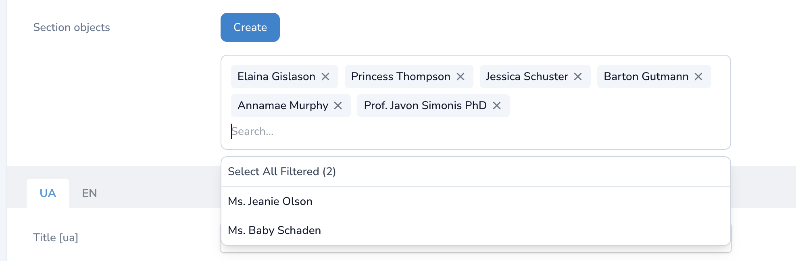

# Laravel Nova BelongsToMany Searchable Field

A Laravel Nova field that provides a searchable interface for belongs-to-many relationships with the ability to create new related resources.



## Requirements

- PHP 8.2+
- Laravel 11.x
- Laravel Nova 4.x / 5.x

## Installation

You can install the package via composer:

```bash
composer require metasync-site/nova-belongs-to-many
```

## Usage

```php
use MetasyncSite\NovaBelongsToMany\BelongsToManySearchable;

 BelongsToManySearchable::make('Products')
            ->relationshipConfig(
                resourceClass: ProductResource::class,
                relationName: 'products',
            ),
    ];
```

### Full api
```php
use MetasyncSite\NovaBelongsToMany\BelongsToManySearchable;

public function fields(NovaRequest $request)
{
    return [
        BelongsToManySearchable::make('Products')
            ->relationshipConfig(
                resourceClass: ProductResource::class,
                relationName: 'products',
                pivotTable: 'category_product',
                foreignPivotKey: 'category_id',
                relatedPivotKey: 'product_id',
                displayCallback: fn($product) => "{$product->name} (${$product->price})"
            )
            ->withCreateButton(true, 'Add New Product'),
    ];
}
```

## Features

- 🔍 Searchable interface for belongs-to-many relationships
- ✨ Custom display formatting with callback support
- ➕ Optional "Create New" button with modal
- 🎨 Dark mode support
- 🎯 Type-safe implementation
- 🔄 Automatic pivot table management

## Configuration Options

### Required Parameters

- `resourceClass`: The Nova resource class for the related model
- `relationName`: The name of the relationship method on your model
- `pivotTable`: The name of the pivot table
- `foreignPivotKey`: The foreign key of the parent model in the pivot table
- `relatedPivotKey`: The foreign key of the related model in the pivot table

### Optional Parameters

- `displayCallback`: Customize how each option is displayed
- `withCreateButton`: Enable the create button with an optional custom label

## Security Vulnerabilities

If you discover any security vulnerabilities, please email metasyncsite@gmail.com

## Credits
- [Metasync](https://github.com/metasyncSite)

